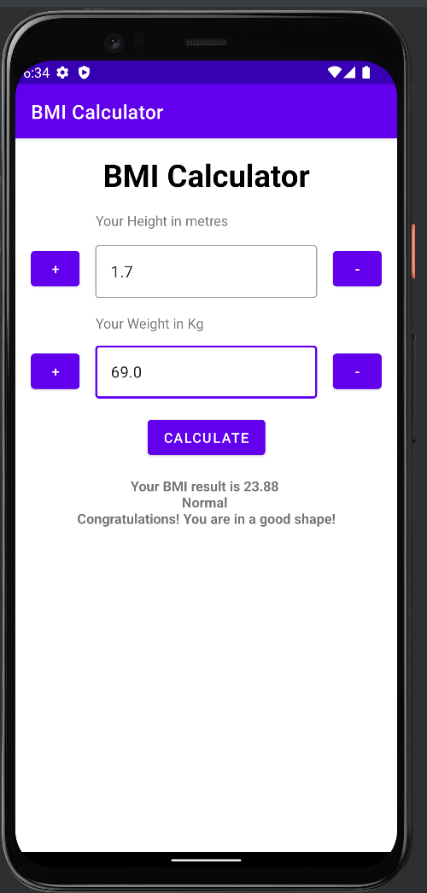
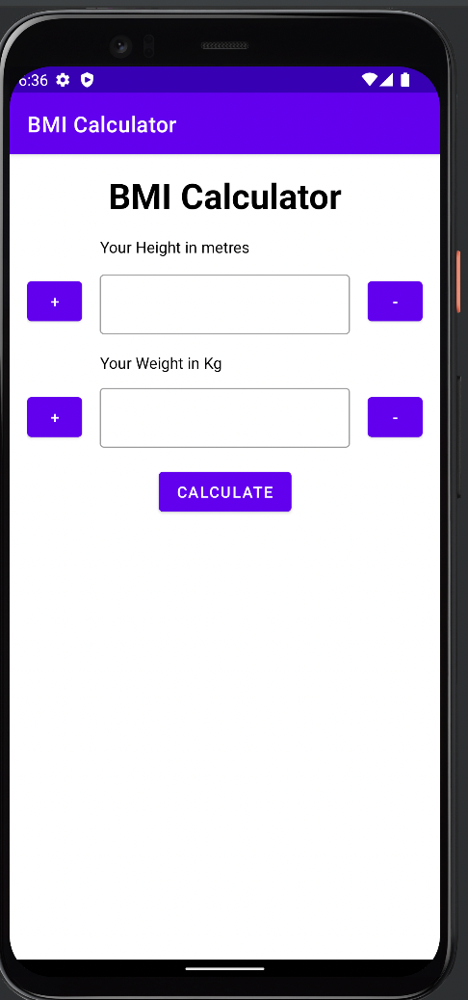

A Beginner Android App for calculating body mass index by [TutorialsEu](https://www.tutorials.eu) in CH02 of the Tiny Kotlin Project
<table>
  <tr>
    <td>

</td>

   <td>

   </td>

  </tr>
</table>
