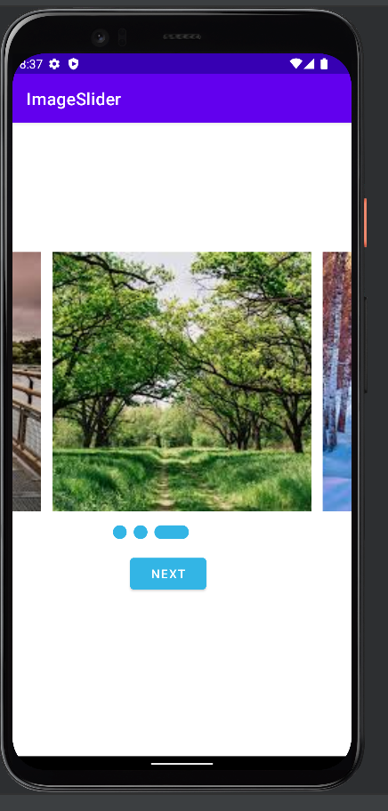

# Image Slider App
An Image Slider app project that will help you understand Android ViewPager 2 and creating swipeable screens by [TutorialsEu](https://www.tutorials.eu)

<table>
  <tr>
    <td>

</td>

  </tr>
</table>
